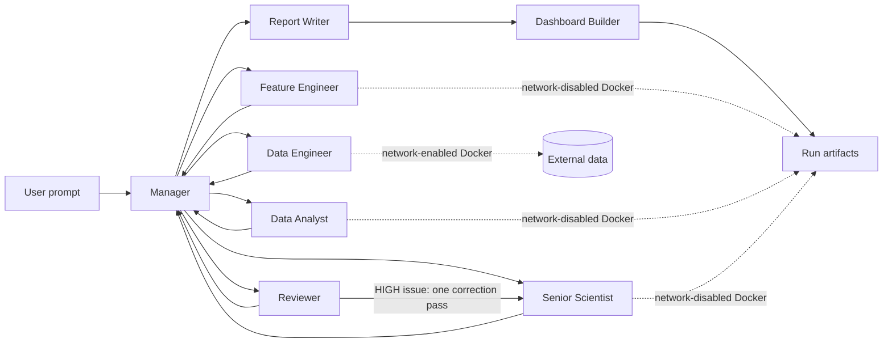

# Multi-Agent Data Science System

LangGraph-powered multi-agent system for solving data science problems from a natural language prompt. The system coordinates specialized AI agents for data acquisition, feature engineering, EDA/modeling, model improvement, methodology review, and final reporting.

## Why This Exists

This project demonstrates production-oriented AI/ML engineering patterns:

- Multi-agent orchestration with LangGraph
- Claude prompt caching through the Anthropic SDK
- Autonomous Python generation and execution
- Hardened Docker execution with resource and network controls
- SQLite checkpoints for resumable LangGraph runs
- Pydantic contracts for manager and reviewer outputs
- Run-scoped artifacts and metadata
- Static HTML dashboards designed for stakeholder readability
- Methodology review for leakage, overfitting, and metric correctness
- Repeatable eval tasks for regression, classification, cleaning, and reporting workflows

## Agent Pipeline

```text
Manager
  -> Data Engineer
  -> Feature Engineer
  -> Data Analyst
  -> Senior Scientist
  -> Reviewer
  -> Report Writer
  -> Dashboard Builder
```

The manager can route failed steps back to the same agent. If the reviewer finds a high-severity issue, the manager gives the scientist one correction pass before reporting.



## Secure Code Execution

Build the generated-code sandbox:

```bash
docker build -f docker/Dockerfile.sandbox -t the-pog-sandbox:latest .
export DS_EXECUTION_BACKEND=docker
```

The Docker backend uses a non-root user, read-only root filesystem, dropped
capabilities, CPU/memory/PID limits, and no network access for modeling agents.
Only the Data Engineer receives network access for data acquisition.

For local development without Docker:

```bash
export DS_EXECUTION_BACKEND=local
```

Local mode is explicitly marked as **not sandboxed** in run output and metadata.

## Resume Interrupted Runs

Runs persist LangGraph state in `checkpoints.sqlite`. Reuse the run ID to resume:

```bash
DS_RUN_ID=20260611_153000 python main.py "The original prompt"
```

## Quickstart

```bash
python3 -m venv .venv
source .venv/bin/activate
pip install -r requirements.txt

cp .env.example .env
# Add ANTHROPIC_API_KEY=... to .env

python main.py "Download the red wine quality CSV, engineer features, train a model, review it, and report"
```

Each run writes artifacts under:

```text
outputs/run_YYYYMMDD_HHMMSS/
  run.json
  outputs/
    clean_data.csv
    engineered_data.csv
    *.png
    report_*.md
    dashboard.html
```

## Eval Harness

List benchmark tasks without spending API credits:

```bash
.venv/bin/python evals/run_evals.py
```

Run one benchmark task:

```bash
.venv/bin/python evals/run_evals.py --run --task wine_regression
```

Results are saved to `evals/results/eval_*.json`.

## Local Checks

```bash
.venv/bin/ruff check .
.venv/bin/python -m unittest discover tests
.venv/bin/python evals/run_evals.py
```

## Resume Framing

**Multi-Agent Data Science Automation System with LangGraph**

- Built an 8-agent LangGraph system that automates data acquisition, feature engineering, modeling, model improvement, methodology review, report generation, and dashboard delivery.
- Implemented Claude prompt caching, SQLite checkpoints, typed Pydantic contracts, run-scoped artifacts, and token usage tracking.
- Isolated generated Python in a hardened Docker backend with resource limits and role-based network access.
- Added an adversarial scientist/reviewer loop to challenge model quality, detect leakage, and trigger corrective modeling passes.
- Generated dashboard artifacts with metric cards, data profiles, caveats, plot captions, and links to run outputs.
- Created an eval harness to benchmark agent completion, artifact generation, and report quality across repeatable ML tasks.
